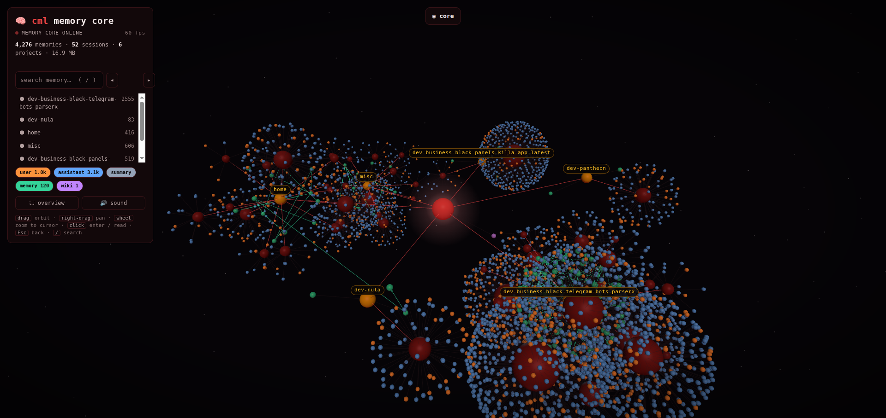
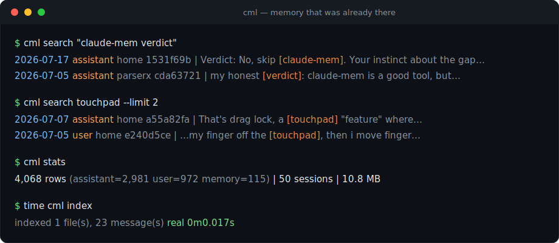
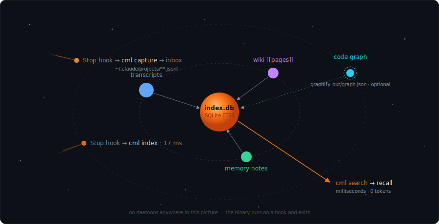

<div align="center">


<br/>


<br/>

[](https://github.com/MiracleWeb3/claude-memory-light/actions)
[](https://github.com/MiracleWeb3/claude-memory-light/releases)
[](LICENSE)
[](https://www.rust-lang.org/)


**[install](#-install)** · **[use](#-use)** · **[the map](#-the-map)** · **[how it works](#-how-it-works)** · **[learning loop](#-the-learning-loop)** · **[wiki](#-the-wiki)** · **[vs claude-mem](#%EF%B8%8F-vs-claude-mem)** · **[cli](#-cli)** · **[faq](#-faq)**

</div>

---

> [!IMPORTANT]
> Claude Code already writes a transcript of every session to `~/.claude/projects/`. Most memory plugins ignore that file and rebuild capture from scratch: lifecycle hooks feeding a background worker, a vector database, summarization calls billed to your token budget. This tool skips capture and indexes what is already on disk.

<div align="center">

<br/><sub>the whole brain, live: 4,276 memories at 60 fps on the laptop iGPU it was built on. The glow is the core, red ganglia are sessions, orange and blue are you and Claude, green is curated memory.</sub>
</div>

The second hit in the demo below is real. The first thing this tool found on my machine was a conversation I'd forgotten, where Claude and I had already evaluated a memory plugin two weeks earlier and reached the same conclusion. That sold me.

## ✨ features

|   |   |
|---|---|
| 🔍 **hybrid search** | every message of every session — FTS5 keywords + local semantic vectors, fused, milliseconds |
| 🧠 **learning loop** | per-turn signals collected into an inbox, consolidated into memory Claude actually loads |
| 📖 **personal wiki** | one markdown page per topic, edited in place, Obsidian-compatible, same index |
| 🌌 **3d memory map** | `cml map` renders your whole memory as an interactive galaxy — one offline HTML file |
| 🪶 **nothing running** | binary executes on a hook, exits in ms; RAM at rest is zero |
| 🔒 **local only** | one SQLite file you own; nothing leaves your machine |
| 🧩 **graph companion** | `cml doctor` auto-detects graphify for code-structure maps |

## 🚀 install

```
/plugin marketplace add MiracleWeb3/claude-memory-light
/plugin install claude-memory-light
```

The plugin fetches a prebuilt binary on first run, or builds with cargo if you have Rust. Then:

```bash
cml index --all   # first full index: 50 sessions ≈ 2 s
cml doctor        # sanity check
```

> [!WARNING]
> Claude Code deletes transcripts after about 30 days by default. Set `"cleanupPeriodDays": 3650` in `~/.claude/settings.json` or your memory has an expiry date.

## 🔭 use

```bash
cml search "wireguard cyprus"                # across ALL sessions, memory notes, wiki
cml search parser --project myapp --limit 20
cml search deploy --role wiki                # only curated wiki pages
```

<div align="center">

</div>

Three bundled skills teach Claude to search memory before re-solving old problems, to consolidate learning signals when they pile up, and to keep the wiki current. You don't run anything by hand.

> [!TIP]
> No hits doesn't mean not found. Try a second and third keyword set: synonyms, error text, filenames. The skill teaches Claude to do exactly that before giving up.

## 🪐 how it works

Everything orbits one SQLite file. Sources feed it, hooks keep it fresh, search beams out of it.

<div align="center">

</div>

<details>
<summary><b>📁 where everything lives</b></summary>

```
~/.claude/claude-memory-light/
├── index.db          # the FTS5 index (disposable, rebuilds in seconds)
├── inbox/            # learning-loop signals, one file per project
│   └── myapp.md
├── wiki/             # your wiki pages
│   └── topic.md
└── bin/cml           # the binary (installed by the bootstrap)
```

Transcripts stay where Claude Code puts them. `cml` never moves or modifies them.

</details>

## 🔁 the learning loop

A Stop hook appends your message from each turn to a per-project inbox file, flagged when it reads like a correction. At session start, once five or more signals accumulate, Claude gets a note telling it to distill them into its persistent memory and clear the inbox. The hooks contain no LLM calls. The distillation happens inside a session you were going to run anyway, where the full context already lives.

## 📖 the wiki

A folder of markdown files, one page per topic, edited in place when facts change. Old states aren't lost; the transcripts keep them. Obsidian opens the folder as a vault. `cml search <topic> --role wiki` finds pages, and the bundled skill keeps Claude writing them.

## 🌌 the map

```bash
cml map          # builds and opens it
```

Your entire memory as a navigable 3D brain: projects orbit the center, sessions cluster around projects, every message is a shaded orb colored by role. Memory notes and wiki pages link to each other through their `[[wikilinks]]`, so the curated layer renders like Obsidian's graph view, except in three dimensions and sitting next to the conversations it came from. Search flies the camera to matches, chips filter by role, clicking a node shows the text and the `cml search` command to pull it in a terminal.

And if the repo you're standing in has a graphify knowledge graph, the map picks it up on its own: `graphify-out/graph.json` renders as a cyan code constellation next to your conversations — functions, files, and concepts in the same space as the sessions that wrote them. `--code <path>` points it anywhere, `--no-code` turns it off.

It boots like a ship computer: a startup sequence, synthesized interface sounds (WebAudio oscillators, no audio files — the mute button remembers), and idle synaptic pulses traveling the links. Hover a node and it grows toward you; click and the thought opens in a fixed reading panel, with a breadcrumb trail — core ▸ project ▸ session ▸ thought — always showing where you are. Esc walks back up. Controls are the standard vocabulary: drag orbits, right-drag pans, the wheel zooms toward your cursor.

The engine is vendored three.js driven by Rust. The layout is precomputed at generation time (deterministic radial shells, zero physics in the browser), and every node renders through instanced meshes — the entire brain is about **ten draw calls**, which is why it holds 60 fps on the integrated laptop GPU it was built on. An fps meter sits in the HUD, and an adaptive quality ladder steps down (pixel ratio → sphere detail → effects) on any renderer that can't keep up.

One static HTML file with the render engine vendored in. Works offline, no CDN, no server. Generating 4,000+ nodes takes well under a second.

## 🛡️ when it breaks

There is no worker process to die. `capture` and `nudge` exit 0 on every code path, including total failure, so a broken install degrades to "no memory" instead of "no Claude".

> [!NOTE]
> The index is disposable. Transcripts are the source of truth, and everything rebuilds from them in seconds:
> ```bash
> rm ~/.claude/claude-memory-light/index.db*
> cml index --all
> ```

## ⚖️ vs claude-mem

claude-mem is the popular one, and it works for plenty of people. It also runs a persistent Express worker on port 37777, needs Bun plus a Python vector database, and summarizes your session with LLM calls while you work. Users on Pro plans have burned a [full 5-hour token budget in under 10 messages](https://github.com/thedotmack/claude-mem/issues/618) with it enabled. When its worker dies, hooks have [locked up every prompt in the session](https://github.com/thedotmack/claude-mem/issues?q=worker+unreachable). I read that issue tracker for an afternoon and wrote this instead.

| | claude-memory-light | claude-mem |
|---|:---:|:---:|
| background processes | ✅ none | ❌ Express worker, port 37777 |
| LLM calls per session | ✅ 0 | ❌ ~50 summarization calls |
| extra runtimes | ✅ none | ❌ Bun + Node + Python/uv + Chroma |
| RAM at rest | ✅ 0 | ❌ 50 MB and up, leak reports exist |
| hook failure mode | ✅ exit 0, session unaffected | ❌ can block all prompts |
| works on subscription plans | ✅ that's the point | ⚠️ author says hold off |
| search | ✅ hybrid: FTS5 + local vectors | ✅ FTS5 + vector (Chroma) |
| vector stack | ✅ [sqlite-vec](https://github.com/asg017/sqlite-vec) in the same db file, 30 MB local model | ❌ Python + Chroma process |

The vector gap is closed, and it stayed on-principle: embeddings come from a local [Model2Vec](https://github.com/MinishLab/model2vec-rs) static model (~30 MB, downloads once, then offline), vectors live in the same SQLite file via sqlite-vec, and search fuses BM25 with KNN using reciprocal rank fusion. Run `cml embed` once to turn it on; after that the Stop hook embeds new rows incrementally. Still zero API calls, still no daemon, still one file you own.

## 🧰 cli

| command | what it does |
|---|---|
| `cml index [--all]` | incremental (or full) reindex of transcripts, memory notes, wiki |
| `cml search <terms> [--project P] [--role R] [--limit N] [--semantic\|--keyword]` | hybrid ranked search |
| `cml embed [--all]` | build (or rebuild) the semantic index — one-time init, then automatic |
| `cml forget <rowid...>` \| `--match "<q>" [--yes]` | purge junk memories, blocklisted so reindexing never resurrects them (`--clear` undoes) |
| `cml distill` | optional LLM curation: a cheap external model (DeepSeek) judges each assistant row — narration dropped, keepers get a one-line gist; runs automatically at index time once a key sits in `deepseek.key` |
| `cml map [--limit N] [--code G] [--no-code] [--no-open]` | build + open the 3D memory map |
| `cml stats` | row counts, DB size |
| `cml doctor` | environment check, graphify detection |
| `cml capture` | *(hook)* append turn's user message to the learning inbox |
| `cml nudge` | *(hook)* consolidation reminder once signals pile up |

<kbd>CML_HOME</kbd> moves the data directory (default `~/.claude/claude-memory-light`). <kbd>CML_NUDGE_THRESHOLD</kbd> tunes the nudge, default 5. <kbd>CML_EMBED_MODEL</kbd> swaps the embedding model — `minishlab/potion-base-32M` for better recall, `minishlab/potion-multilingual-128M` for non-English corpora; run `cml embed --all` after switching.

## ❓ faq

<details>
<summary><b>does my data leave the machine?</b></summary>
<br/>

No. One SQLite file in your home directory. No cloud, no sync, no telemetry, no accounts.

</details>

<details>
<summary><b>does it cost tokens?</b></summary>
<br/>

Zero. Indexing and search are pure SQLite. Nothing in the hook path calls a model. That's the reason this exists.

</details>

<details>
<summary><b>how does semantic search work without an API?</b></summary>
<br/>

A Model2Vec static embedding model (~30 MB) runs locally — it's a lookup table plus mean pooling, so embedding is effectively instant even on weak hardware. Vectors sit in a sqlite-vec table inside the same index.db. `cml embed` builds it once (needs network for the one-time model download); after that everything is offline. Queries run both legs — BM25 and KNN — and fuse the rankings. `--keyword` or `--semantic` forces a single leg.

</details>

<details>
<summary><b>windows?</b></summary>
<br/>

Untested. The transcript format and Rust are portable, so it should be close. PRs welcome.

</details>

<details>
<summary><b>how big does the index get?</b></summary>
<br/>

About 11 MB for 50 sessions / 4,000 messages on my machine. SQLite FTS5 handles orders of magnitude more without noticing.

</details>

## 🗺️ roadmap

- [x] FTS5 index over transcripts, memory notes, wiki
- [x] learning loop (capture + nudge)
- [x] plugin packaging, prebuilt binaries
- [x] 3d memory map with wikilink edges, offline, single file
- [x] code-graph layer: graphify's `graph.json` renders in the same map
- [x] `sqlite-vec` semantic search — local Model2Vec embeddings, hybrid RRF, same file, no daemon
- [ ] optional end-of-session digests (batched, single call, opt-in)
- [ ] windows support

## ⭐ star history

<div align="center">

[](https://star-history.com/#MiracleWeb3/claude-memory-light&Date)

</div>

## 📄 license

[MIT](LICENSE) © [MiracleWeb3](https://github.com/MiracleWeb3)

<div align="center">


**[⬆ back to top](#claude-memory-light)**

</div>
