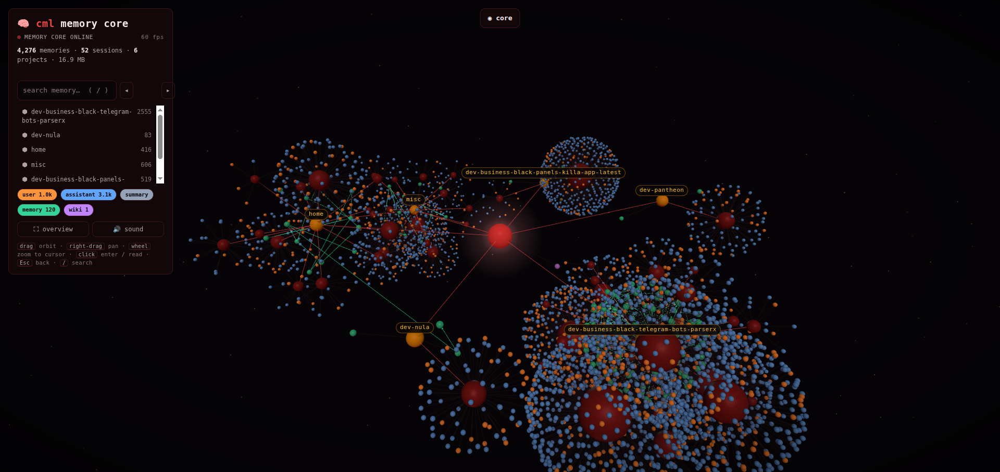
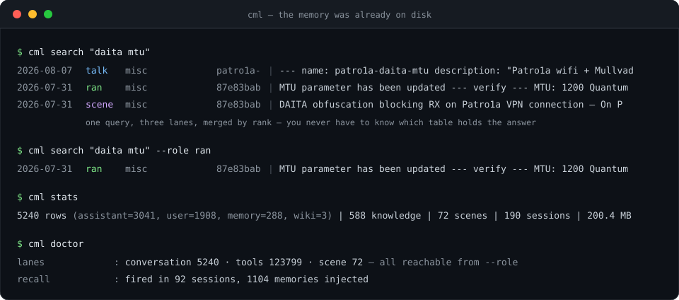
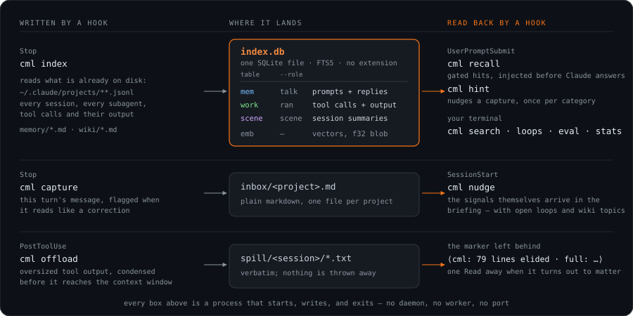

<div align="center">


<br/>


<br/>

[](https://github.com/MiracleWeb3/claude-memory-light/actions)
[](https://github.com/MiracleWeb3/claude-memory-light/releases)
[](LICENSE)
[](https://en.cppreference.com/w/cpp/20)


**[install](#-install)** · **[use](#-use)** · **[recall](#-recall--the-read-half)** · **[the map](#-the-map)** · **[how it works](#-how-it-works)** · **[learning loop](#-the-learning-loop)** · **[wiki](#-the-wiki)** · **[vs claude-mem](#%EF%B8%8F-vs-claude-mem)** · **[cli](#-cli)** · **[faq](#-faq)**

</div>

---

> [!IMPORTANT]
> Claude Code already writes a transcript of every session to `~/.claude/projects/`. Most memory plugins ignore that file and rebuild capture from scratch: lifecycle hooks feeding a background worker, a vector database, summarization calls billed to your token budget — an elaborate machine for forgetting most of what happened. This tool skips capture and indexes what is already on disk. All of it.

<div align="center">

<br/><sub>the whole brain, live, at 60 fps on the laptop iGPU it was built on — this is <code>--raw</code>, every row plotted. The default view shows only what earned a gist. The glow is the core, red ganglia are sessions, orange and blue are you and Claude, green is curated memory.</sub>
</div>

The second hit in the demo below is real. The first thing this tool found on my machine was a conversation I'd forgotten, where Claude and I had already evaluated a memory plugin two weeks earlier and reached the same conclusion. That sold me.

## ✨ features

|   |   |
|---|---|
| 🔍 **full-text search** | every message of every session, BM25 over FTS5, milliseconds; `--semantic` adds local vectors for meaning-only queries |
| 🎯 **automatic recall** | every prompt queries the index on `UserPromptSubmit` — your own history arrives as context, with no command to remember |
| 📏 **it ships its own benchmark** | `cml eval` measures recall@k against your real history, no labelling — the only published retrieval number of any Claude Code memory plugin |
| 🧠 **learning loop** | per-turn signals collected into an inbox, consolidated into memory Claude actually loads |
| 📖 **personal wiki** | one markdown page per topic, edited in place, Obsidian-compatible, same index |
| 🌌 **3d memory map** | `cml map` renders your whole memory as an interactive galaxy — one offline HTML file |
| 🪶 **nothing running** | binary executes on a hook, exits in ms; RAM at rest is zero |
| 🔒 **local only** | one SQLite file you own; nothing leaves your machine |
| 🧩 **graph companion** | `cml doctor` auto-detects graphify for code-structure maps |
| 🧭 **session briefing** | SessionStart nudge adds open loops and a wiki topic menu, capped and size-metered, skipped on resume/compact |
| 🔂 **chronic loops** | `cml loops` surfaces asks that keep recurring across sessions, unresolved |
| ⚖️ **durability gate** | keeping and plotting are separate decisions — the map holds a few hundred hard-won facts, not every true sentence |
| 💡 **prompt hints** | zero-token classifier flags a prompt as correction / preference / decision / method / reference, once per session each |

## 🚀 install

```
/plugin marketplace add MiracleWeb3/claude-memory-light
/plugin install claude-memory-light
```

The plugin fetches a prebuilt binary on first run, or builds from source with cmake (needs a C++20 compiler and the sqlite3 + simdjson headers; `curl` is only needed at runtime, and only if you turn on distillation). Then:

```bash
cml index --all   # first full index: 50 sessions ≈ 2 s
cml doctor        # sanity check
```

> [!WARNING]
> Claude Code deletes transcripts after about 30 days by default. Set `"cleanupPeriodDays": 3650` in `~/.claude/settings.json` or your memory has an expiry date.

## 🔭 use

```bash
cml search "wireguard cyprus"                # across ALL sessions, memory notes, wiki
cml search parser --project myapp --limit 20
cml search deploy --role wiki                # only curated wiki pages
```

<div align="center">

</div>

Three bundled skills teach Claude to search memory before re-solving old problems, to consolidate learning signals when they pile up, and to keep the wiki current. You don't run anything by hand.

> [!TIP]
> No hits doesn't mean not found. Try a second and third keyword set: synonyms, error text, filenames. The skill teaches Claude to do exactly that before giving up.

## 🪐 how it works

Everything orbits one SQLite file. Sources feed it, hooks keep it fresh, search beams out of it.

<div align="center">

</div>

<details>
<summary><b>📁 where everything lives</b></summary>

```
~/.claude/claude-memory-light/
├── index.db          # the FTS5 index (disposable, rebuilds in seconds)
├── inbox/            # learning-loop signals, one file per project
│   └── myapp.md
├── wiki/             # your wiki pages
│   └── topic.md
└── bin/cml           # the binary (installed by the bootstrap)
```

Transcripts stay where Claude Code puts them. `cml` never moves or modifies them.

</details>

## 🎯 recall — the read half

Capture was hooked from the first commit. Retrieval never was, and that asymmetry is the whole story. Measured across 564 transcripts on the machine this was built on: the write side ran **625 times** (`index` 321, `capture` 304), the read side ran **20** — `cml search`, in 12 sessions, **2%**. The index was in good shape and almost nobody read it, because reading it was a decision the model had to remember to make, and a decision made 2% of the time is indistinguishable from a feature that does not exist.

So `cml recall` runs on `UserPromptSubmit` and the model is not consulted. Every prompt queries the index; whatever clears the gates arrives as context before Claude answers.

The gates are what keep it from becoming wallpaper, and they were tuned against the corpus rather than guessed:

- **rarity** — a term appearing in more than 6% of the index is dropped before the query runs. Without it, *"do we have the same problem in all the code"* matched on `code` and `problem` and dragged in a row from an unrelated project. Firing rate before this gate existed: **76%** of real prompts. After: **28%**.
- **substance** — fewer than two surviving terms means the prompt asks nothing. `yes`, `ok`, `do it` recall nothing.
- **overlap** — a row sharing one word with your prompt is a coincidence. Two is a topic.
- **echo** — a row that *is* your prompt, asked once before, tells Claude nothing that isn't already on screen. The answer to it might; the echo never does.
- **novelty** — a row already injected this session is not injected again.

Fires on about half the prompts it sees, mean **2.1** hits, **~550 bytes** injected, and the whole hook runs in **milliseconds**. One FTS5 query — the embedding leg was measured to make this path worse and was removed from it (see [the number](#the-number)). Still no LLM call anywhere in it.

## 🔁 the learning loop

A Stop hook appends your message from each turn to a per-project inbox file, flagged when it reads like a correction. At session start, once five or more signals accumulate, Claude gets a note telling it to distill them into its persistent memory and clear the inbox. The hooks contain no LLM calls. The distillation happens inside a session you were going to run anyway, where the full context already lives.

That same SessionStart hook also briefs you on what's still open: chronic asks that keep recurring across sessions (the logic behind `cml loops`, capped to the top 3), and a menu of wiki topics on file so Claude knows what it can pull in before re-deriving something already written down. Both are skipped on `resume`/`compact` sources — re-injecting static context on every resume is exactly the bloat this is budgeted against — but the inbox nag above still fires there if it's due. The whole message reports its own size inline (`[context injected: N.NkB]`): measured 1.2kB on a fresh start on this repo's own index, 0.5kB on resume where only the nag can still trigger.

A third hook, sharing `UserPromptSubmit` with recall above, classifies each prompt against a phrase table — correction, preference, decision, method, reference — and once per session per category, injects a one-line nudge to capture it (`cml hint`), e.g. *"reads like a durable preference — consider capturing it so future sessions inherit it."* It's a suggestion, never a write: the model still decides what's worth keeping. Still zero LLM calls anywhere in the loop, just SQL and string matching.

## 📖 the wiki

A folder of markdown files, one page per topic, edited in place when facts change. Old states aren't lost; the transcripts keep them. Obsidian opens the folder as a vault. `cml search <topic> --role wiki` finds pages, and the bundled skill keeps Claude writing them.

## 🌌 the map

```bash
cml map          # builds and opens it
```

Your memory as a navigable 3D brain: projects orbit the center, sessions cluster around projects, every fact is a shaded orb colored by role. The map plots knowledge, not rows — a message earns a point by carrying a durable fact, and everything else stays searchable without becoming one. Most rows never earn one. On the corpus this was built against, 1,077 rows produce 369 points, and the 708 that stay dark are status reports, mode acknowledgments, and answers to questions that will not come up again. `--raw` puts every row back. Memory notes and wiki pages link to each other through their `[[wikilinks]]`, so the curated layer renders like Obsidian's graph view, except in three dimensions and sitting next to the conversations it came from. Search flies the camera to matches, chips filter by role, clicking a node shows the text and the `cml search` command to pull it in a terminal.

If the repo you're standing in has a graphify knowledge graph, `--code` renders it as a cyan code constellation beside your conversations — functions, files, and concepts in the same space as the sessions that wrote them. It is opt-in on purpose: the overlay occupies a single orbital slot, a project's worth, while carrying up to 3000 nodes, so enabling it packs a solid sphere in front of the brain. Bare `--code` auto-detects `graphify-out/graph.json`; `--code <path>` points it anywhere. For reading code structure on its own, graphify's own viewer is the better tool.

It boots like a ship computer: a startup sequence, synthesized interface sounds (WebAudio oscillators, no audio files — the mute button remembers), and idle synaptic pulses traveling the links. Hover a node and it grows toward you; click and the thought opens in a fixed reading panel, with a breadcrumb trail — core ▸ project ▸ session ▸ thought — always showing where you are. Esc walks back up. Controls are the standard vocabulary: drag orbits, right-drag pans, the wheel zooms toward your cursor.

The engine is vendored three.js driven by C++. The layout is precomputed at generation time (deterministic radial shells, zero physics in the browser), and every node renders through instanced meshes — the entire brain is about **ten draw calls**, which is why it holds 60 fps on the integrated laptop GPU it was built on. An fps meter sits in the HUD, and an adaptive quality ladder steps down (pixel ratio → sphere detail → effects) on any renderer that can't keep up.

One static HTML file with the render engine vendored in. Works offline, no CDN, no server. Generating 4,000+ nodes takes well under a second.

## 🛡️ when it breaks

There is no worker process to die. `capture`, `nudge`, `hint`, and `recall` exit 0 on every code path, including total failure, so a broken install degrades to "no memory" instead of "no Claude". When the binary itself is missing, the bootstrap still emits valid passthrough JSON for all four.

> [!NOTE]
> The index is disposable. Transcripts are the source of truth, and everything rebuilds from them in seconds:
> ```bash
> rm ~/.claude/claude-memory-light/index.db*
> cml index --all
> ```

## ⚖️ vs claude-mem

claude-mem is the popular one, and it works for plenty of people. It also runs a persistent Bun worker on a local HTTP port (default `37700 + uid % 100`, historically 37777), needs Node plus Bun plus a Python vector database, and summarizes your session with LLM calls while you work. Users on Pro plans have burned a [full 5-hour token budget in under 10 messages](https://github.com/thedotmack/claude-mem/issues/618) with it enabled. When the worker doesn't come up, its hook has [failed in a loop and blocked prompts](https://github.com/thedotmack/claude-mem/issues/2926). I read that issue tracker for an afternoon and wrote this instead.

| | claude-memory-light | claude-mem |
|---|:---:|:---:|
| background processes | ✅ none | ❌ Express worker, port 37777 |
| calls against your Claude plan | ✅ never, on any code path | ❌ summarization runs on it |
| other LLM calls | ⚠️ none by default; optional curation calls a model you configure | ❌ required, built in |
| extra runtimes | ✅ none | ❌ Bun + Node + Python/uv + Chroma |
| RAM at rest | ✅ 0 | ❌ 50 MB and up, leak reports exist |
| hook failure mode | ✅ exit 0, session unaffected | ❌ can block all prompts |
| works on subscription plans | ✅ that's the point | ⚠️ [budget burned in under 10 messages](https://github.com/thedotmack/claude-mem/issues/618) |
| search | ✅ BM25 + doc2query expansions; vectors on `--semantic` | ✅ FTS5 + vector (Chroma) |
| automatic retrieval | ✅ every prompt, gated, **measured** | ✅ at session start, progressive disclosure |
| what's kept | ✅ every message, verbatim, forever | ⚠️ an LLM summary; the rest is gone |
| sessions from before you installed it | ✅ all of them — the transcripts were already there | ❌ none |
| a search hit is | ✅ the actual message | ⚠️ a paraphrase of it |
| retrieval quality | ✅ **published, with the command to reproduce it** | ❓ no number published |

### the number

Every comparison table on the internet, including the one above, is adjectives. So this ships the benchmark instead:

```bash
cml eval          # recall@k over YOUR history
```

No labelling needed — when you asked something at turn N, the assistant answered at turn N+1, so that row *is* the ground truth. Replay the question, see whether the answer comes back. On the corpus this was developed against (1,171 rows, 272 question/answer pairs):

```
fired           : 136 (50%)
recall@3        : 40 (14.8% of all questions, 29.4% of the ones it answered)
recall@1        : 30 (11.1%)
```

That is not a great number. It is a **real** one, it is reproducible on your own machine, and it is the only such number published by any Claude Code memory plugin — so treat any competitor's "semantic understanding" claim, including the one this README used to make, as unmeasured until someone prints a figure next to it.

### what the benchmark cost us

It immediately killed a feature this project had been advertising. `cml eval --vectors` re-runs with the embedding leg on:

| retrieval | recall@3 | recall@1 |
|---|:---:|:---:|
| BM25 + doc2query | **40 (14.8%)** | **30 (11.1%)** |
| \+ embedding rerank | 35 (13.0%) | 21 (7.8%) |

The vector leg was making retrieval **worse** — and the previous version of this section claimed "the vector gap is closed" as a selling point. Four measurements across two corpus states said otherwise, so it was removed from the automatic path. We then wrote a BERT encoder from scratch in C++ (`src/encoder/`, bge-small-en-v1.5 — the model our static one was distilled *from*) to check whether a real contextual model would win. It halved the damage and still lost to plain BM25.

The cause is structural: retrieval requires two shared content words before a row is injected, so a purely semantic match cannot survive the pipeline however the fusion is arranged. Vectors stay for `cml search --semantic`, where they do something BM25 genuinely cannot — asked for *"trackpad dragging"* it returns **touchpad** rows.

**Where claude-mem is ahead:** it compresses. Fifty LLM calls buy a summary of a 200k-token session; we have no equivalent and don't attempt one, because we retrieve the original instead. It is also vastly more adopted, and adoption is not something a benchmark fixes.

**vault-template plugins** (e.g. [obsidian-mind](https://github.com/breferrari/obsidian-mind)) are a folder of markdown plus an instruction manual telling Claude how to file notes into it. Read the code before the stars. Of obsidian-mind's 27 commands and agents, three do memory; the rest is performance-review tooling (brag docs, 1:1 trackers, standup generators). The "brain" ships as empty placeholder files. Nothing is captured unless you run a command, so it remembers exactly what you remember to tell it: a diary with extra steps, not memory. Semantic search is outsourced to an optional external engine that wants ~1.6 GB of local models and ~1.28 GB of RAM per reranked query; when it isn't installed, "semantic search" quietly means grep. And the filing instructions are loaded into every session, thousands of tokens deep, before you type a word.

Your memory already exists. It's the transcripts. Index them; don't make a human the capture hook.

| | claude-memory-light | vault-template plugins |
|---|:---:|:---:|
| capture | ✅ automatic, every transcript already on disk | ⚠️ manual, only what gets filed via a command |
| semantic search | ✅ hybrid FTS5 + vectors, in the one binary | ⚠️ typically a separate tool, GB-scale local model |
| standing context cost | ✅ ~0 standing; briefing measured at 1.2kB on a fresh start, 0.5kB on resume | ⚠️ always-loaded filing instructions, thousands of tokens/session |

## 🧰 cli

| command | what it does |
|---|---|
| `cml index [--all]` | incremental (or full) reindex of transcripts, memory notes, wiki |
| `cml search <terms> [--project P] [--role R] [--limit N] [--semantic\|--keyword]` | hybrid ranked search |
| `cml embed [--all]` | build (or rebuild) the semantic index — one-time init, then automatic |
| `cml forget <rowid...>` \| `--match "<q>" [--yes]` | purge junk memories, blocklisted so reindexing never resurrects them (`--clear` undoes) |
| `cml distill [--all] [--limit N]` | optional LLM curation: a cheap external model (DeepSeek by default) judges every row on two independent axes — *keep* (is there content?) and *durable* (worth a permanent point?). Undurable rows are kept and stay searchable, they simply carry no gist. Once a key sits in `llm.key`, `cml index` starts this **detached in the background** — it costs ~20s a row, so it can never run on the Stop hook's clock; the last run's outcome shows up in `cml doctor`. `--all` re-judges from scratch, `--limit` caps rows per run |
| `cml map [--limit N] [--code [G]] [--no-open] [--raw]` | build + open the 3D memory map; `--raw` plots every row instead of only knowledge, `--code` overlays graphify's code graph (opt-in) |
| `cml loops [--days N] [--limit K]` | chronic-loop detection: asks recurring across ≥2 sessions in the window, most-recurrent first (default 30 days, top 10) |
| `cml stats` | row counts, knowledge count, DB size |
| `cml doctor` | environment check, graphify detection, which binary is running, and what the last background curation run actually did |
| `cml version` | version of *this* binary — the hooks run an installed copy, so it need not match the repo you are reading |
| `cml capture` | *(hook)* append turn's user message to the learning inbox |
| `cml nudge` | *(hook)* SessionStart briefing: learning-inbox nag (always eligible), plus open loops and wiki topics (skipped on resume/compact) |
| `cml hint` | *(hook)* UserPromptSubmit: phrase-table classifier nudges a capture, once per session per category |
| `cml recall` | *(hook)* UserPromptSubmit: retrieves against the prompt and injects the top matches, gated on rarity, substance, overlap, echo and novelty |
| `cml eval [-k N] [--limit N] [--vectors] [--no-asks]` | recall@k against your own history; the flags ablate the embedding leg and the doc2query expansions so any claim here stays checkable |

<kbd>CML_HOME</kbd> moves the data directory (default `~/.claude/claude-memory-light`). <kbd>CML_NUDGE_THRESHOLD</kbd> tunes the nudge, default 5. <kbd>CML_EMBED_MODEL</kbd> swaps the embedding model — `minishlab/potion-base-32M` for better recall, `minishlab/potion-multilingual-128M` for non-English corpora; run `cml embed --all` after switching.

## ❓ faq

<details>
<summary><b>does my data leave the machine?</b></summary>
<br/>

No. One SQLite file in your home directory. No cloud, no sync, no telemetry, no accounts.

</details>

<details>
<summary><b>does it cost tokens?</b></summary>
<br/>

**None of your Claude budget, on any code path.** That's the reason this exists.

Indexing, search, recall and embedding are pure local compute — SQLite plus a local embedding model. No network, no model call.

One feature is the exception and it is off until you turn it on: **curation** (`cml distill`). If you put a key in `~/.claude/claude-memory-light/llm.key`, the Stop hook will judge new rows through whatever OpenAI-compatible endpoint you configured — DeepSeek by default, capped at 40 rows per rubric per turn. That is a cheap external model you chose and pay for separately; it never touches your Claude plan. Delete the key file and it stops. With no key there is no network call anywhere in this tool.

</details>

<details>
<summary><b>how does semantic search work without an API?</b></summary>
<br/>

A Model2Vec static embedding model (~30 MB) runs locally — it's a lookup table plus mean pooling, so embedding is effectively instant even on weak hardware. Vectors sit in a sqlite-vec table inside the same index.db. `cml embed` builds it once (needs network for the one-time model download); after that everything is offline. Queries run both legs — BM25 and KNN — and fuse the rankings. `--keyword` or `--semantic` forces a single leg.

</details>

<details>
<summary><b>why C++, not Rust?</b></summary>
<br/>

It started in Rust. sqlite3 and simdjson are C libraries either way, and the Rust build spent a binding crate (rusqlite) reaching code that's already C. The C++ port calls both directly — same two libraries, no binding layer between the binary and the API it's using. Full port, nothing left in Rust.

</details>

<details>
<summary><b>windows?</b></summary>
<br/>

Untested. The transcript format is the same and the code is portable C++, so it should be close. PRs welcome.

</details>

<details>
<summary><b>how big does the index get?</b></summary>
<br/>

About 11 MB for 50 sessions / 4,000 messages on my machine. SQLite FTS5 handles orders of magnitude more without noticing.

</details>

## 🗺️ roadmap

- [x] FTS5 index over transcripts, memory notes, wiki
- [x] learning loop (capture + nudge)
- [x] plugin packaging, prebuilt binaries
- [x] 3d memory map with wikilink edges, offline, single file
- [x] code-graph layer: graphify's `graph.json` renders in the same map
- [x] `sqlite-vec` semantic search — local Model2Vec embeddings, hybrid RRF, same file, no daemon
- [x] Rust → C++ port — sqlite3 and simdjson called directly, no binding layer
- [x] session briefing — chronic open loops and a wiki topic menu folded into the SessionStart nudge, capped and size-metered
- [x] `cml loops` — chronic-loop detection: asks that recur across sessions, surfaced from the index
- [x] `cml hint` — UserPromptSubmit phrase-table classifier that nudges a capture, once per session per category
- [x] `cml recall` — the read half hooked: every prompt retrieves against the index, so recall stops depending on the model remembering to search
- [x] `cml eval` — recall@k over your own transcripts, no labelling; the first published retrieval number for a Claude Code memory plugin
- [x] doc2query — the curator writes how you would *search* for a row, indexed beside it
- [x] a BERT encoder in C++ (`src/encoder/`) — built to test whether contextual vectors beat BM25 here. They do not. Kept for `--semantic`, dropped from the automatic path.
- [ ] optional end-of-session digests (batched, single call, opt-in)
- [ ] windows support

## ⭐ star history

<div align="center">

[](https://star-history.com/#MiracleWeb3/claude-memory-light&Date)

</div>

## 📄 license

[MIT](LICENSE) © [MiracleWeb3](https://github.com/MiracleWeb3)

<div align="center">


**[⬆ back to top](#claude-memory-light)**

</div>

## bring your own curator

The optional distillation layer speaks to any OpenAI-compatible `/chat/completions` endpoint. Drop an API key into `~/.claude/claude-memory-light/llm.key` and it activates; two env vars point it anywhere:

```bash
# DeepSeek (default — nothing to configure but the key)
CML_LLM_URL=https://api.deepseek.com/chat/completions   CML_LLM_MODEL=deepseek-v4-pro

# OpenRouter — any model on the router
CML_LLM_URL=https://openrouter.ai/api/v1/chat/completions   CML_LLM_MODEL=deepseek/deepseek-chat

# GLM / Zhipu
CML_LLM_URL=https://open.bigmodel.cn/api/paas/v4/chat/completions   CML_LLM_MODEL=glm-4-flash
```

No key, no calls — the curator is off by default and the brain stays fully local.
